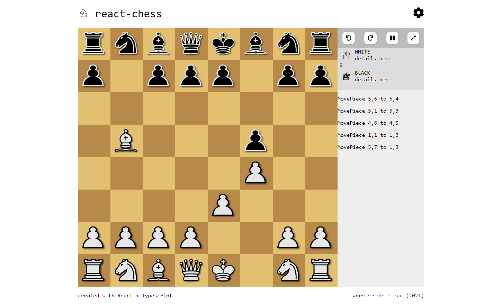

# react-chess

  

### Todo

- [x] Gameplay
  - [x] Get basic chess gameplay running
  - [x] Add game time, reset board, undo button, etc (QoL)
  - [x] Ensure game is responsive and can be played on phone with touch
- [ ] Website design
  - [x] Complete layout
  - [ ] Complete light and dark themes
  - [ ] Cleanup UI
  - [ ] Smooth piece movement (including undo & redo actions)
- [ ] Chess AI (human vs bot match)
  - [x] Minmax
  - [x] Alpha-beta pruning
  - [ ] Move ordering
  - [ ] Improve evaluations
  - [ ] Optimizations + make asynchronous
- [ ] Multiplayer (human vs human)
  - [ ] Allow players to create and join lobbies
  - [ ] Synchronize gameplay between clients
- [ ] Host project online

### Libraries used
This project is built with  
- React
- Vite
- TypeScript
- Styled Components
- React FontAwesome
- React Router
- fscreen

Chess pieces from [OpenGameArt](https://opengameart.org/content/chess-pieces-and-board-squares).  


### Building

To run this project locally  
```
git clone https://github.com/zaccnz/react-chess.git
cd react-chess
npm install
npm run dev
```
  
You can also build this project...
```
npm run build
```
then host it on GitHub pages  
```
npm run deploy
```
